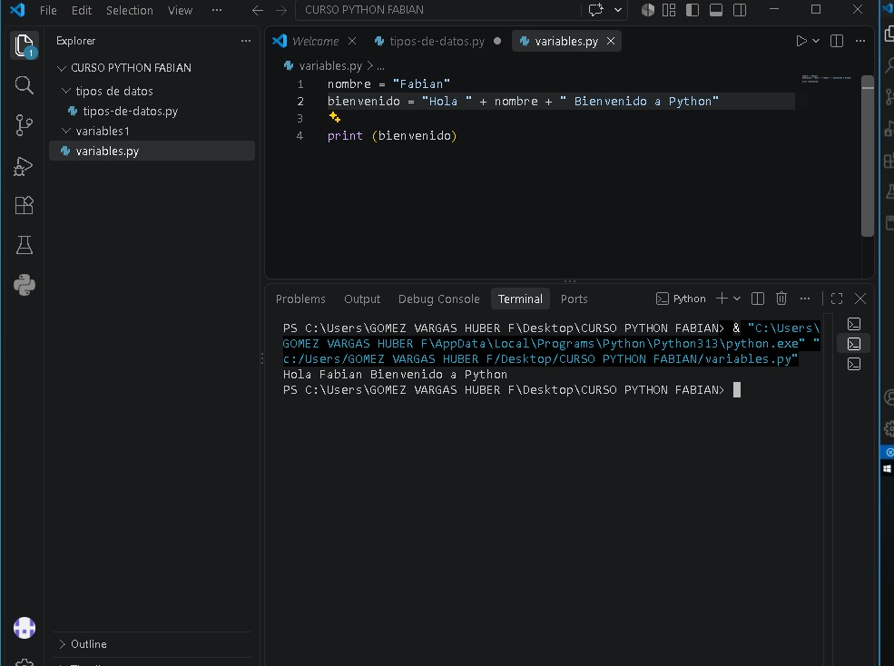

# CURSO PYTHON FABIAN 🐍

Repositorio de mis prácticas de programación en Python. Aquí documento mi aprendizaje desde cero con variables, tipos de datos y fundamentos del lenguaje.

## 📚 Contenido del Curso

- **/tipos de datos** - Prácticas de tipos de datos básicos (int, str, float, bool)
- **/variables1** - Manejo de variables y concatenación

## 💻 Práctica Destacada: Variables

``python
nombre = "Fabian"
bienvenido = "Hola " + nombre + " Bienvenido a Python"
print(bienvenido)

