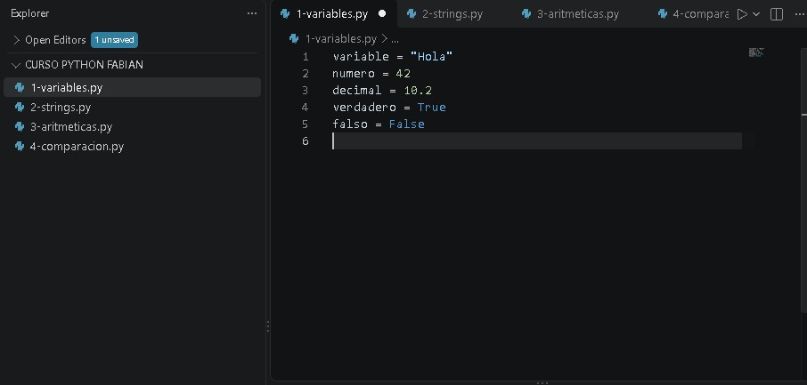
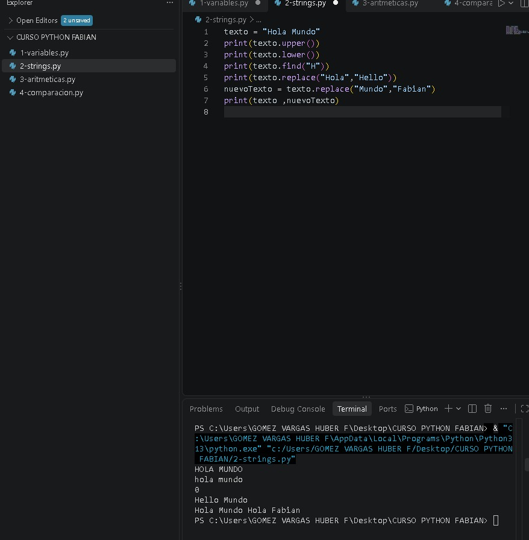
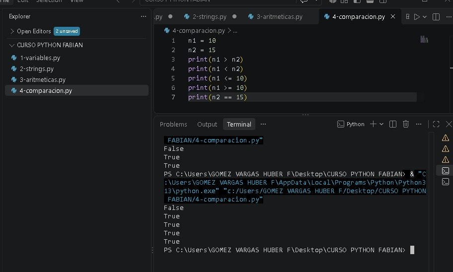
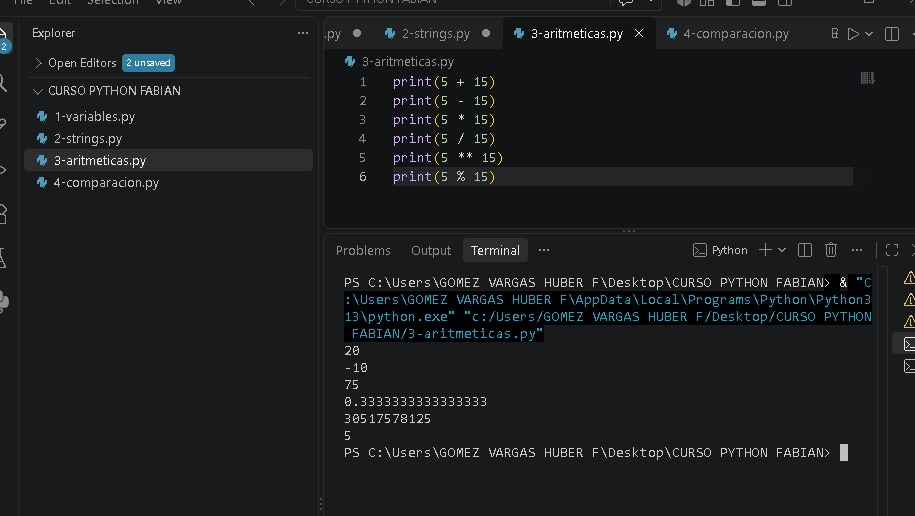

# Python - Prácticas  1

En esta primera parte del curso estuve practicando los conceptos básicos de Python y realizando pequeños ejercicios para familiarizarme con el lenguaje.

## Temas practicados

- Variables y tipos de datos.
- Strings y manejo de textos.
- Operaciones aritméticas.
- Operadores de comparación.

## Archivos

- `1-variables.py` → Creación y uso de variables.
  
- `2-strings.py` → Manejo y modificación de textos.
  
- `3-aritmeticas.py` → Operaciones matemáticas básicas.
  
- `4-comparacion.py` → Comparación entre valores.
   

Estas prácticas me ayudaron a entender la sintaxis básica de Python y cómo realizar operaciones sencillas.
