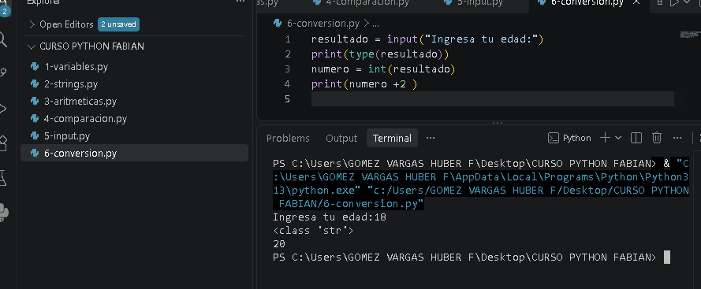
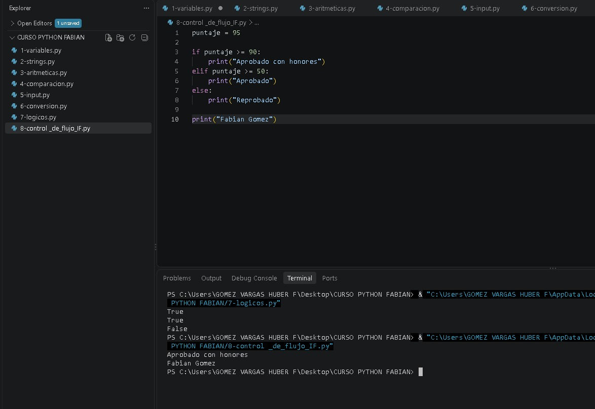
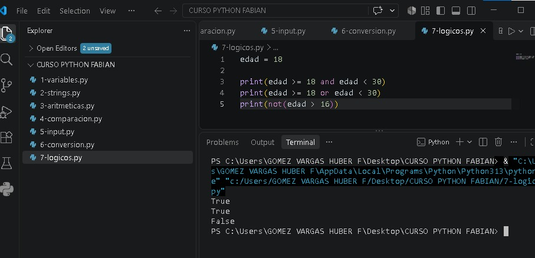

# Python - Prácticas 2

En esta segunda parte continué practicando Python, trabajando con entrada de datos, conversión de tipos, operadores lógicos y estructuras condicionales.

## Temas practicados

- Entrada de datos con `input()`.
- Conversión de tipos de datos.
- Operadores lógicos.
- Estructuras condicionales.

## Archivos

- `5-input.py` → Ingreso de datos por teclado.

- `6-conversion.py` → Conversión de texto a números.

- `7-logicos.py` → Uso de `and`, `or` y `not`.

- `8-control_de_flujo_IF.py` → Uso de `if`, `elif` y `else`.

Con estas prácticas sigo reforzando mis conocimientos y aprendiendo a crear programas sencillos en Python.
