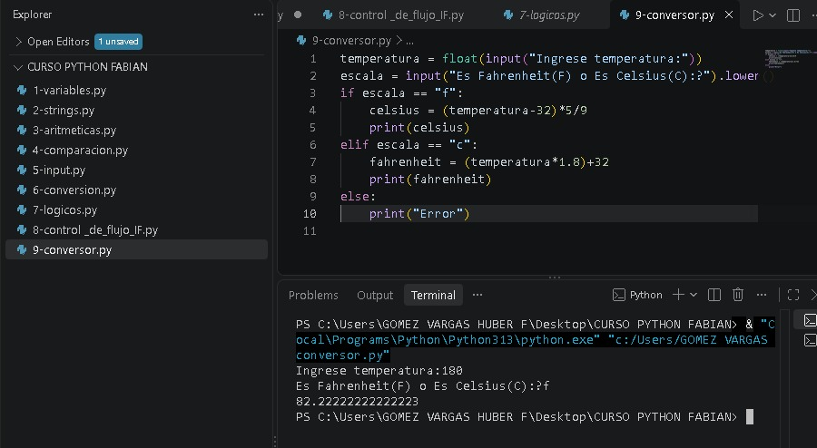
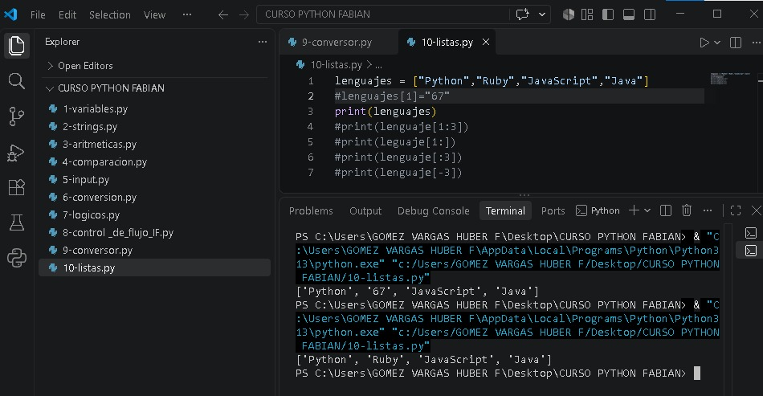
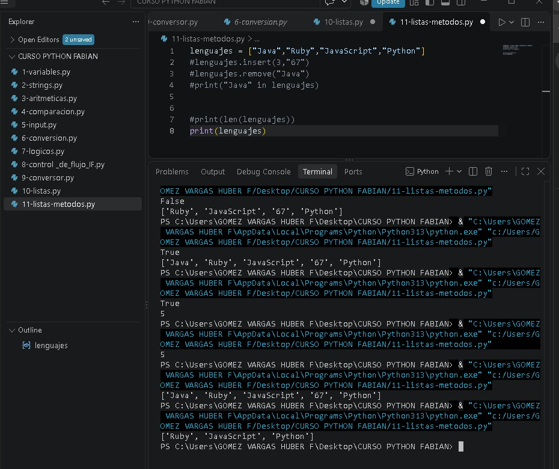
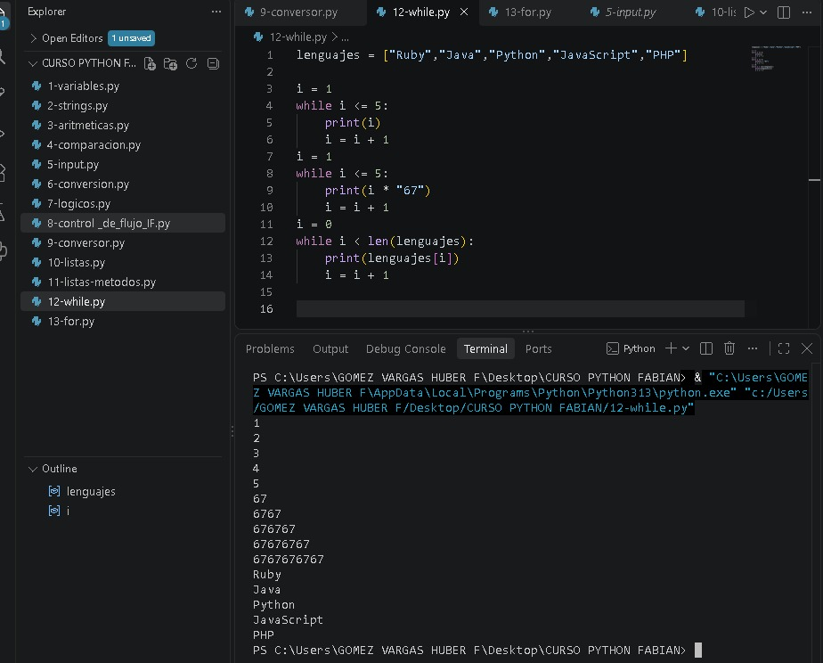
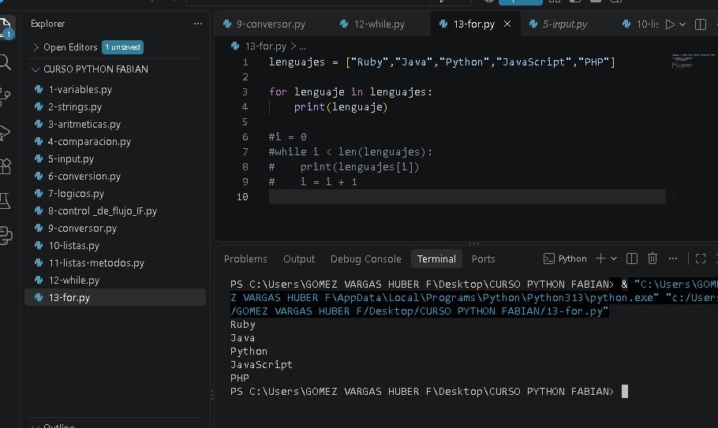

# Curso de Python - Prácticas 3

En esta tercera parte del curso continué practicando Python mediante diferentes ejercicios. Trabajé con la conversión de temperaturas, el uso de listas, los métodos para modificar y consultar listas, y las estructuras repetitivas `while` y `for`.

## Temas practicados

- Conversión de temperaturas entre Celsius y Fahrenheit.
- Creación y manejo de listas.
- Uso de métodos para modificar listas.
- Recorrido de elementos mediante ciclos.
- Uso del ciclo `while`.
- Uso del ciclo `for`.

## Archivos

- `9-conversor.py` → Programa para convertir temperaturas entre Celsius y Fahrenheit.

- `10-listas.py` → Creación de listas y acceso a sus elementos mediante índices.

- `11-listas-metodos.py` → Uso de diferentes métodos para agregar, eliminar y modificar elementos de una lista.

- `12-while.py` → Uso del ciclo `while` para repetir instrucciones mientras se cumpla una condición.

- `13-for.py` → Uso del ciclo `for` para recorrer e imprimir los elementos de una lista. También incluye un ejemplo comentado de cómo realizar un recorrido similar utilizando `while`.

## Objetivo

El objetivo de estas prácticas fue seguir reforzando mis conocimientos de Python y aprender a trabajar con listas y estructuras repetitivas para desarrollar programas de forma más organizada.
